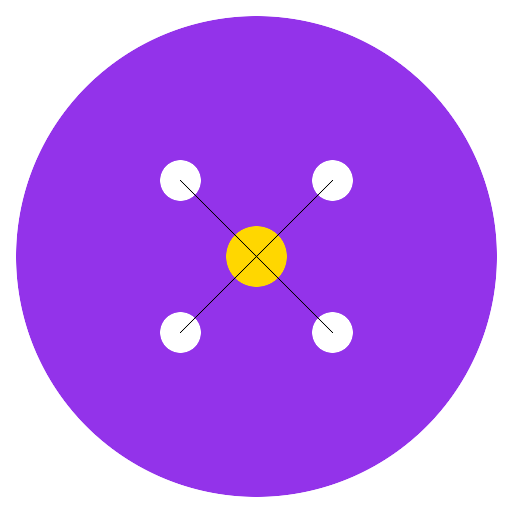

# NextJS Sniffer

A desktop application for inspecting server-side HTTP events from Next.js backends. Monitor, filter, and debug all your server-side network requests in real-time with a beautiful DevTools-like interface.



## 🚀 Quick Start

### Install the Desktop App

1. **Download the latest release**: [GitHub Releases](https://github.com/evendrop/next-sniffer/releases)
2. **Install**:
   - **macOS**: Open the `.dmg` file and drag to Applications
   - **Windows**: Run the `.exe` installer
   - **Linux**: Make the `.AppImage` executable and run it

3. **Launch** the app - it will start a local server on port 9432

### Integrate with Your Next.js App

1. **Copy the interceptor** to your Next.js project:
   ```bash
   cp apps/desktop/next-instructions/network-sniffer-interceptor.ts lib/
   ```

2. **Add one line** to your server API file (e.g., `lib/server-api.ts`):
   ```typescript
   import { setupNetworkSniffer } from './lib/network-sniffer-interceptor';
   
   export const serverApiClient = axios.create({ ... });
   setupNetworkSniffer(serverApiClient); // Add this line
   ```

That's it! All your server-side HTTP requests will now appear in NextJS Sniffer.

📖 **Detailed integration guide**: See [apps/desktop/next-instructions/INTEGRATION_EXAMPLE.md](apps/desktop/next-instructions/INTEGRATION_EXAMPLE.md)

## ✨ Features

- 🔍 **Real-time Monitoring**: See requests/responses as they happen
- 🎯 **Advanced Filtering**: Filter by method, status, host, time range, and search
- 🔒 **Security**: Automatically redacts sensitive headers (auth, cookies, API keys)
- 💾 **Persistent Storage**: SQLite database stores all events across app restarts
- 📊 **Request Correlation**: Trace IDs link related request/response/error events
- 📋 **Export & Copy**: Export events as JSON or copy as cURL commands
- 🎨 **Beautiful UI**: DevTools-inspired interface with dark/light mode support
- 🔔 **Error Alerts**: Dock notifications and badges for errors (macOS)
- 🔄 **Auto-Updates**: Automatic update checking and installation

## 📦 Project Structure

```
next-sniffer/
├── apps/
│   └── desktop/              # Electron desktop application
│       ├── electron/         # Main process and server
│       ├── ui/               # React UI
│       ├── next-instructions/ # Next.js integration files
│       └── scripts/          # Utility scripts
├── README.md                  # This file
└── RELEASE_GUIDE.md          # Release instructions
```

## 🛠️ Development

### Prerequisites

- Node.js 18+
- Yarn
- macOS/Windows/Linux (for building)

### Setup

```bash
# Install dependencies
cd apps/desktop
yarn install

# Run in development mode
yarn dev
```

### Building

```bash
# Build for production
yarn build

# Create installer/package for current platform
yarn dist

# Build for specific platforms
yarn dist:mac    # macOS (DMG)
yarn dist:win    # Windows (NSIS installer)
yarn dist:linux  # Linux (AppImage)
```

#### Cross-Platform Building

You can build Windows and Linux installers from macOS:

**For Windows builds on macOS:**
1. Install Wine (required for Windows builds):
   ```bash
   brew install --cask wine-stable
   ```
2. Build Windows installer:
   ```bash
   yarn dist:win
   ```

**For Linux builds on macOS:**
- Linux builds work without additional dependencies:
  ```bash
  yarn dist:linux
  ```

**Note:** Code signing for Windows requires a Windows environment and certificate. The build will work, but won't be signed when built from macOS.

See [apps/desktop/README.md](apps/desktop/README.md) for detailed development instructions.

## 📖 Documentation

- **[Desktop App README](apps/desktop/README.md)**: Complete documentation for the desktop app
- **[Integration Guide](apps/desktop/next-instructions/INTEGRATION_EXAMPLE.md)**: Step-by-step Next.js integration
- **[Release Guide](RELEASE_GUIDE.md)**: How to create and publish releases
- **[Auto-Updates Guide](apps/desktop/AUTO_UPDATES.md)**: Auto-update configuration

## 🔧 Configuration

### Environment Variables (Next.js)

Add to your `.env.local`:

```bash
NETWORK_SNIFFER_URL=http://127.0.0.1:9432/events  # Default
NETWORK_SNIFFER_ENABLED=true  # Set to 'false' to disable
```

### App Settings

The desktop app stores settings in:
- **macOS**: `~/Library/Application Support/NextJS Sniffer/settings.json`
- **Windows/Linux**: Electron userData directory

## 🐛 Troubleshooting

### macOS "App is damaged" error

If you see "NextJS Sniffer is damaged and can't be opened":

1. **Quick fix**:
   ```bash
   cd apps/desktop
   yarn fix:gatekeeper
   ```

2. **Manual fix**:
   ```bash
   xattr -dr com.apple.quarantine release/*.app
   ```

3. **Alternative**: Right-click the app → "Open" → Click "Open" in the dialog

This happens because the app isn't code signed. For production releases, you should code sign and notarize the app.

### Events not appearing

1. Make sure NextJS Sniffer app is running
2. Verify the app shows "Server listening on http://127.0.0.1:9432"
3. Check your Next.js app is POSTing to `http://127.0.0.1:9432/events`
4. Verify `NETWORK_SNIFFER_ENABLED=true` in your Next.js `.env.local`

### Port 9432 already in use

The app will show an error if the port is in use. Close any other applications using port 9432, or kill the process:

```bash
# macOS/Linux
lsof -ti:9432 | xargs kill -9

# Windows
netstat -ano | findstr :9432
```

### Integration not working

- Make sure you've added `setupNetworkSniffer(serverApiClient)` after creating your axios instance
- Check that the interceptor file is in the correct location
- Verify your axios instance is being used for server-side requests

## 🤝 Contributing

Contributions are welcome! Please feel free to submit a Pull Request.

## 📄 License

MIT

## 🔗 Links

- **GitHub**: https://github.com/evendrop/next-sniffer
- **Releases**: https://github.com/evendrop/next-sniffer/releases

